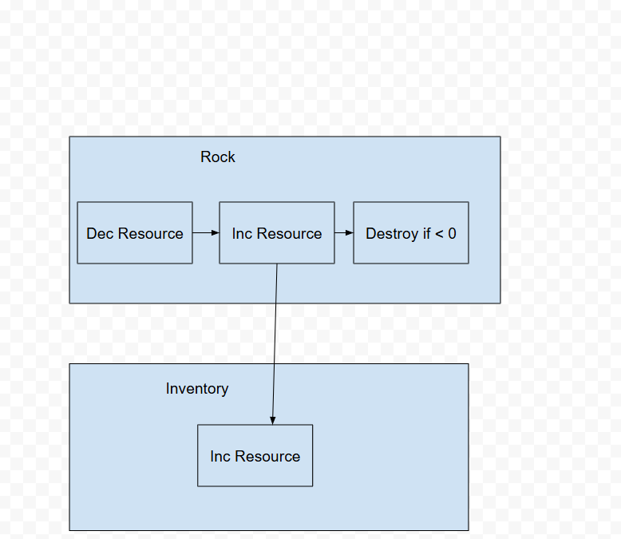
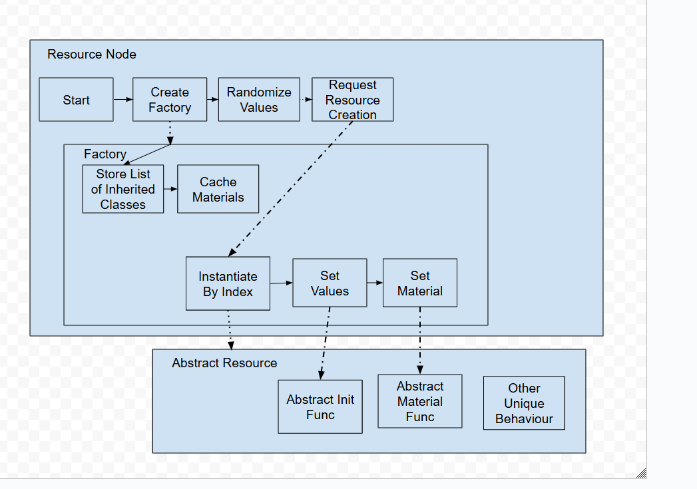

# EnginesInLab

Spencer Harley - 100864012

## Walking Factory Game

Mine the rock by pressing space (hold it down for a duration!) nearby and add the ore to your inventory. 

Singleton Diagram:

Factory Pattern Diagram:

I desperately wanted to avoid using Scriptable Objects in this project because I dislike adding both a new script and a new scriptable object that uses that script just for one variant. However, Scriptable Objects seem to be the only way to slot in classes that inherit from eachother from the editor. Using the factory pattern with a designer-friendly slot in the editor seems incredibly pointless, so my comprimize was to load prefabs using the resource loader, which means the file paths are hardcoded as strings. It really feels like there should be a inspector slot that allows putting in structs that inherit from a base class. Godot doesn't have this problem as it lacks restrictions on typing and its Resource class is much more intuitive than Unity's Scriptable Objects. Overall I do see some cases in which this pattern would be useful in Unity, mostly in cases where Scriptable Objects are already justified such as a status effect system. 

Observer Pattern:

To see this pattern in practice:
1. Find a car, one of them is directly down from the spawn location.
2. Enter the car by interacting with the cylinder that is on the edge of the car.
3. Start driving by interacting with the cylinder that is in the centre front of the car.
   
The player's inputs are broadcast as an event that can be listened to by multiple sources. By default this is the player's own movement, however if you enter a car and start driving the player's movement stops observing and the car's movement starts observing instead. 
I feel it was a good use of this pattern as I may expand the game to have multiple vehicles or other objects that require movement input to use. Other objects being able to observe the player's inputs and being able to switch out the dedfualt behaviour is very flexible. 
